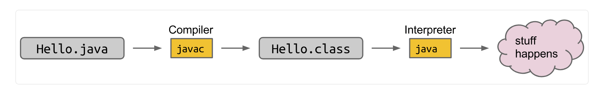

## 1.1 第一课内容与作业

好的，以下是对作业内容的详细解释：

### 作业0B：数据结构
#### 作业设置
请按照“作业工作流程指南”开始此作业。该作业的标识是.hw0b。



### 语言结构
#### 类型
- **Java** 是一种静态类型语言，这意味着每个变量的类型在编译时就已知，需要在代码中明确指定。相比之下，**Python** 是动态类型语言，变量的类型通常只有在运行时才知道，不需要在代码中明确指定。

- 在Java中，有两种类型：基本类型primitive types和引用类型 reference types。基本类型用小写字母表示，包括`boolean`、`int`、`char`、`double`等。引用类型则是其他所有类型，例如`String`。如果一个类型以大写字母开头，它很可能是引用类型。

- 每个基本类型都有一个对应的引用类型，如`Boolean`、`Integer`、`Character`、`Double`。当使用泛型声明数据结构时，必须使用引用类型。

#### null
- Java有`null`，大致相当于Python的`None`。任何引用类型都可以被赋值为`null`。如果试图从`null`调用实例成员或方法，会抛出`NullPointerException`。

### java语法基础

```
int x = (int)Math.pow(2, 10);// 2**10
```

#### string

```
s = "hello"
s += " world"
s += str(5)
s_length = len(s)
substr = s[1:5]
c = s[2]
if "hello" in s:
    print("\"hello\" in s")

for letter in s:
    print(letter)
```

```
String s = "hello";
s += " world";
s += 5;
int sLength = s.length();
String substr = s.substring(1, 5);
char c = s.charAt(2);
if (s.indexOf("hello") != -1) {
    System.out.println("\"hello\" in s");
}
for (int i = 0; i < s.length(); i++) {
    char letter = s.charAt(i);
    System.out.println(letter);
}
```


### 数组（固定大小）

- Java数组类似于Python列表，但Java数组是固定大小的，不能添加或删除元素。

```python
# Python
zeroedLst = [0, 0, 0]
lst = [4, 7, 10]
lst[0] = 5
print(lst[0])
print(lst)
print(len(lst))
```

```java
// Java
int[] zeroedArray = new int[3];
int[] array = {4, 7, 10};
array[0] = 5;
System.out.println(array[0]);
System.out.println(Arrays.toString(array));
System.out.println(array.length);
```

- 在`new int[3]`中，`int`是数组的类型，`3`是数组的长度。使用这种语法时，所有元素都将采用其“默认值”。对于`int`，默认值是0。

### 增强for循环
- Java中的增强for循环类似于Python的for循环。

```python
# Python
lst = [1, 2, 3]
for i in lst:
    print(i)
```

```java
// Java
int[] array = {1, 2, 3};
for (int i : array) {
    System.out.println(i);
}
```

- 注意Java中迭代变量的类型声明以及使用`:`而不是`in`。

### 列表（可调整大小）
- Java中使用`List`接口，通常使用`ArrayList`实现。

```python
# Python
lst = []
lst.append("zero")
lst.append("one")
lst[0] = "zed"
print(l[0])
print(len(l))
if "one" in lst:
    print("one in lst")

for elem in lst:
    print(elem)
```

```java
// Java
import java.util.ArrayList;
import java.util.List;
List<String> lst = new ArrayList<>();
lst.add("zero");
lst.add("one");
lst.set(0, "zed");
System.out.println(lst.get(0));
System.out.println(lst.size());
if (lst.contains("one")) {
    System.out.println("one in lst");
}
for (String elem : lst) {
    System.out.println(elem);
}
```

Java有接口nterface.。我们主要使用ArrayList实现。List 接口通过它所持有的类型进行参数化，使用尖括号和 .List<> 同样，列表不支持切片或负索引。

### 集合

- Java中使用`Set`接口，主要有`TreeSet`和`HashSet`两种实现。

```python
# Python
s = set()
s.add(1)
s.add(1)
s.add(2)
s.remove(2)
print(len(s))
if 1 in s:
    print("1 in s")

for elem in s:
    print(elem)
```

```java
// Java
Set<Integer> set = new HashSet<>();
set.add(1);
set.add(1);
set.add(2);
set.remove(2);
System.out.println(set.size());
if (set.contains(1)) {
    System.out.println("1 in set");
}
for (int elem : set) {
    System.out.println(elem);
}
```

### 字典/映射
- Java中使用`Map`接口，主要有`TreeMap`和`HashMap`两种实现。

```python
# Python
d = {}
d["hello"] = "hi"
d["hello"] = "goodbye"
print(d["hello"])
print(len(d))
if "hello" in d:
    print("\"hello\" in d")

for key in d.keys():
    print(key)
```

```java
// Java
Map<String, String> map = new HashMap<>();
map.put("hello", "hi");
map.put("hello", "goodbye");
System.out.println(map.get("hello"));
System.out.println(map.size());
if (map.containsKey("hello")) {
    System.out.println("\"hello\" in map");
}
for (String key : map.keySet()) {
    System.out.println(key);
}
```

### 类
- Python和Java中类的定义和使用方式。

```python
# Python
class Point:
    def __init__(self, x, y):
        self.x = x
        self.y = y

    def distanceTo(self, other):
        return math.sqrt(
            (self.x - other.x) ** 2 +
            (self.y - other.y) ** 2
        )

    def translate(self, dx, dy):
        self.x += dx
        self.y += dy
```

```java
// Java
public class Point {
    public int x;
    public int y;
    public Point(int x, int y) {
        this.x = x;
        this.y = y;
    }
    public Point() {
        this(0, 0);
    }
    public double distanceTo(Point other) {
        return Math.sqrt(
            Math.pow(this.x - other.x, 2) +
            Math.pow(this.y - other.y, 2)
        );
    }
    public void translate(int dx, int dy) {
        this.x += dx;
        this.y += dy;
    }
}
```

### 主方法
- Java程序有一个特殊的方法叫`main`，当你执行一个程序时，这个方法会被调用。

```python
# Python
if __name__ == '__main__':
    p1 = Point(5, 9)
    p2 = Point(-3, 3)
    print(f"Point 1: ({p1.x}, {p1.y})")
    print("Distance:", p1.distanceTo(p2))
    p1.translate(2, 2)
    print(f"Point 1: ({p1.x}, {p1.y})")
```

```java
// Java
public class Point {
    // 其他方法...

    public static void main(String[] args) {
        Point p1 = new Point(5, 9);
        Point p2 = new Point(-3, 3);
        System.out.println("Point 1: ( " + p1.x
            + ", " + p1.y + ")");
        System.out.println("Distance: "
            + p1.distanceTo(p2));
        p1.translate(2, 2);
        System.out.println("Point 1: ( " + p1.x
            + ", " + p1.y + ")");
    }

    // Point类的结尾
}
```

### 程序示例
- 寻找数字列表中的最小索引。

```python
# Python
def min_index(numbers):
    # 假设len(numbers) >= 1
    m = numbers[0]
    idx = 0
    for i in range(len(numbers)):
        if numbers[i] < m:
            m = numbers[i]
            idx = i
    return idx
```

```java
// Java
public static int minIndex(int[] numbers) {
    // 假设numbers.length >= 1
    int m = numbers[0];
    int idx = 0;
    for (int i = 0; i < numbers.length; i++) {
        if (numbers[i] < m) {
            m = numbers[i];
            idx = i;
        }
    }
    return idx;
}
```

### 异常处理
- 在Java和Python中抛出异常的方法。

```python
# Python
def minIndex(numbers):
    if len(numbers) == 0:
        raise Exception("列表中没有元素！")
    m = numbers[0]
    idx = 0

    # 其他代码...

    return m
```

```java
// Java
public static int minIndex(int[] numbers) {
    if (numbers.length == 0) {
        throw new Exception("数组中没有元素！");
    }
    int m = numbers[0];
    int idx = 0;

    // 其他代码...

    return m;
}
```

以上是详细解释，希望对你理解作业内容有所帮助。

好的，我们从头开始讲解什么是包装类型，并详细介绍`Integer`包装类型的语法、用法和功能理念。

### 包装类型的概念

在Java中，包装类型（Wrapper Classes）是为每种基本数据类型（Primitive Types）提供的对应的类。这些类包装了基本数据类型的值，使得它们能够作为对象来操作。这在需要对象引用的地方非常有用，例如在集合框架中（如`List`、`Set`等）。

Java中每个基本数据类型都有一个对应的包装类型：

- `byte` -> `Byte`
- `short` -> `Short`
- `int` -> `Integer`
- `long` -> `Long`
- `float` -> `Float`
- `double` -> `Double`
- `char` -> `Character`
- `boolean` -> `Boolean`

### `Integer`包装类型

`Integer`是包装基本数据类型`int`的类。它提供了将`int`值转换为对象以及在需要对象的地方使用`int`值的能力。

#### 1. 创建`Integer`对象

有几种方式可以创建一个`Integer`对象：

```java
public class IntegerExample {
    public static void main(String[] args) {
        // 使用构造函数
        Integer intObj1 = new Integer(10); // 已过时，不推荐
        // 使用静态方法valueOf
        Integer intObj2 = Integer.valueOf(10);
        // 自动装箱
        Integer intObj3 = 10;

        System.out.println("intObj1: " + intObj1);
        System.out.println("intObj2: " + intObj2);
        System.out.println("intObj3: " + intObj3);
    }
}
```

#### 2. 自动装箱和拆箱

Java提供了自动装箱（Autoboxing）和拆箱（Unboxing）功能，可以在基本数据类型和对应的包装类型之间自动转换。

```java
public class AutoboxingUnboxingExample {
    public static void main(String[] args) {
        // 自动装箱：将基本类型int转换为包装类型Integer
        Integer intObj = 100;
        // 自动拆箱：将包装类型Integer转换为基本类型int
        int intValue = intObj;

        System.out.println("intObj: " + intObj);
        System.out.println("intValue: " + intValue);
    }
}
```

#### 3. 常用方法

`Integer`类提供了许多实用的方法：

- `intValue()`：返回`Integer`对象的`int`值。
- `parseInt(String s)`：将字符串解析为`int`类型。
- `valueOf(String s)`：返回保存指定字符串的`Integer`对象。
- `compareTo(Integer anotherInteger)`：比较两个`Integer`对象的数值。
- `equals(Object obj)`：比较两个`Integer`对象的值是否相等。

```java
public class IntegerMethodsExample {
    public static void main(String[] args) {
        Integer intObj = Integer.valueOf(42);

        // 使用intValue方法
        int intValue = intObj.intValue();
        System.out.println("intValue: " + intValue);

        // 使用parseInt方法
        int parsedValue = Integer.parseInt("123");
        System.out.println("parsedValue: " + parsedValue);

        // 使用compareTo方法
        Integer anotherIntObj = Integer.valueOf(100);
        int comparisonResult = intObj.compareTo(anotherIntObj);
        System.out.println("comparisonResult: " + comparisonResult);

        // 使用equals方法
        boolean isEqual = intObj.equals(anotherIntObj);
        System.out.println("isEqual: " + isEqual);
    }
}
```

#### 4. 处理`null`值

包装类型可以处理`null`值，而基本数据类型不能。这在需要表示缺失值或不确定值时非常有用。

```java
public class NullHandlingExample {
    public static void main(String[] args) {
        Integer nullableInt = null;

        if (nullableInt == null) {
            System.out.println("nullableInt is null");
        } else {
            System.out.println("nullableInt is not null");
        }

        // 注意：对null值进行自动拆箱会抛出NullPointerException
        try {
            int intValue = nullableInt;
        } catch (NullPointerException e) {
            System.out.println("NullPointerException caught");
        }
    }
}
```

### 总结

- 包装类型允许基本数据类型作为对象处理，提供了面向对象编程的便利性。
- `Integer`是`int`的包装类型，提供了许多实用的方法来操作整数值。
- 自动装箱和拆箱使得基本数据类型和包装类型之间的转换变得非常方便。
- 包装类型可以处理`null`值，而基本数据类型不能。

通过这些概念和示例，相信你对`Integer`包装类型有了一个全面的理解。如果有进一步的问题或需要更详细的讲解，随时告诉我！