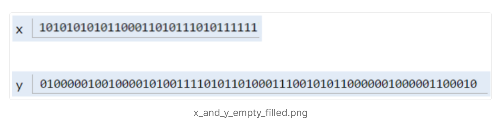
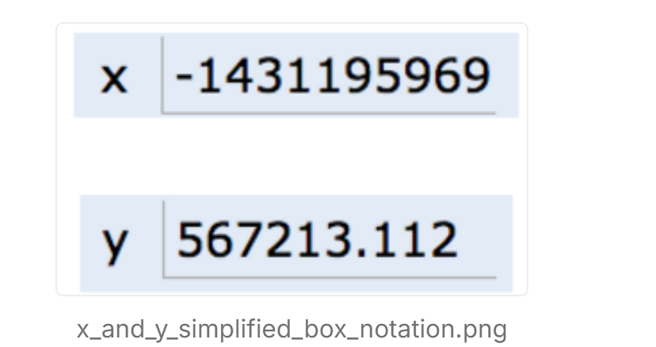
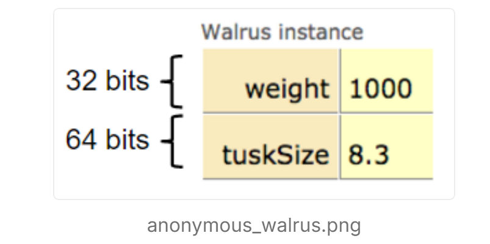
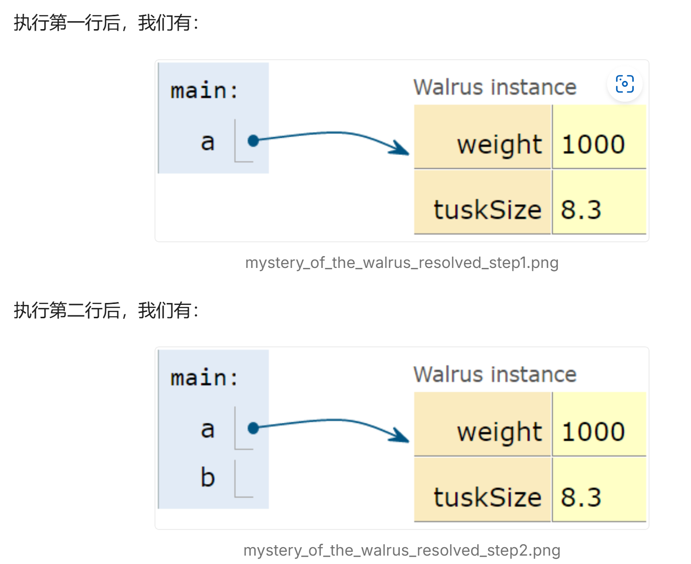
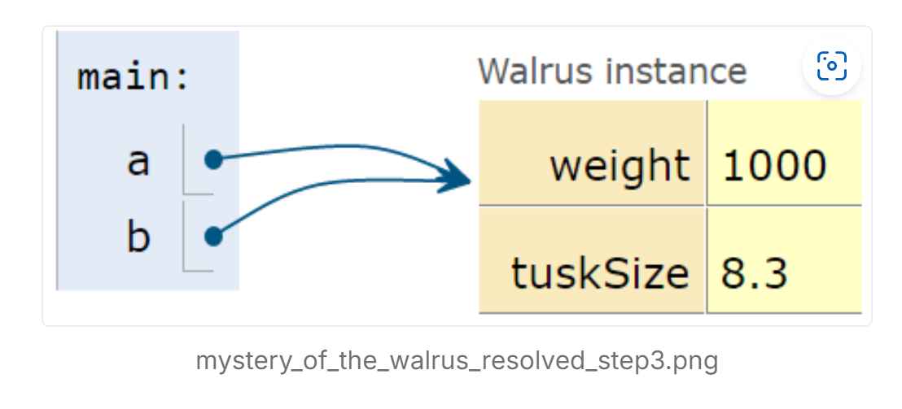

### 3. 引用、递归和列表

#### 列表（Lists）

在Project 0中，我们使用数组来跟踪N个物体在空间中的位置。然而，一旦模拟开始，就很难改变物体的数量，因为Java中的数组大小是固定的。另一种方法是使用列表类型。在本章中，我们将从头开始构建自己的列表，同时学习Java的一些关键特性。

#### 海象之谜（The Mystery of the Walrus）

试预测以下代码的运行结果。对`b`的修改是否会影响`a`？提示：如果你来自Python，Java有相同的行为。

```java
Walrus a = new Walrus(1000, 8.3);
Walrus b;
b = a;
b.weight = 5;
System.out.println(a);
System.out.println(b);
```

再预测以下代码的运行结果。对`x`的修改是否会影响`y`？

```java
int x = 5;
int y;
y = x;
x = 2;
System.out.println("x is: " + x);
System.out.println("y is: " + y);
```

#### 位（Bits）

计算机中的所有信息都以一串零和一的形式存储在内存中。例如：

- 72 通常存储为 01001000
- 205.75 通常存储为 01000011 01001101 11000000 00000000
- 字母 H 通常存储为 01001000（与72相同）

在本课程中，我们不会详细讨论特定的二进制表示形式。理解具体的表示形式是后续课程CS61C的内容。尽管我们不会学习二进制语言，但知道这是底层的运行方式是有好处的。

#### 声明变量（Declaring a Variable）

可以把计算机看作包含大量存储信息的内存位，每个位都有唯一地址。现代计算机有数十亿这样的位。

当你声明某种类型的变量时，Java会找到一个连续的位块，足以存储该类型的内容。例如，声明一个`int`会得到一个32位的块，声明一个`byte`会得到一个8位的块。每种数据类型在Java中占据不同的位数。

为了便于理解，我们称这些位块为“盒子（box）”。

除了分配内存外，Java解释器还会在内部表中创建一个条目，将每个变量名映射到盒子中第一个位的位置。

例如，声明`int x`和`double y`后，Java可能会使用计算机内存中的第352到384位来存储`x`，使用第20800到20864位来存储`y`。解释器会记录`int x`从第352位开始，`y`从第20800位开始。

Java语言不提供获取盒子位置的方法，例如，无法找到`x`的位置。这与C语言不同，C语言可以获取数据的确切地址。这是Java的一个折衷：隐藏内存位置减少了控制权，但避免了许多复杂的编程错误。

Java在声明变量时不会在预留的盒子中写入任何内容，因此没有默认值。Java编译器会防止在变量赋值前使用它。因此，我们不会在盒子中显示任何位。

当你给内存盒子赋值时，它会被指定的位填充。例如，执行以下代码：

```java
x = -1431195969;
y = 567213.112;
```

内存盒子将如图所示填充：



这些位序列代表这些数字的原因不重要，这是CS61C的内容。如果好奇，可以查看Wikipedia上的整数表示和双精度表示。

#### 简化盒子表示法（Simplified Box Notation）

简化盒子表示法更适合实际用途，因为我们不需要解释二进制位。

例如，执行以下代码后：

```java
int x;
double y;
x = -1431195969;
y = 567213.112;
```

我们可以用简化盒子表示法表示程序环境：



#### 等号的黄金法则（Golden Rule of Equals, GRoE）

理解海象之谜的关键是等号的黄金法则：`y = x`意味着将`x`的位复制到`y`中。这个简单的复制位的规则适用于Java中的任何赋值。

```java
int x = 5;
int y;
y = x;
x = 2;
System.out.println("x is: " + x);
System.out.println("y is: " + y);
```

#### 引用类型（Reference Types）

除了八种基本类型（primitive types）：`byte`、`short`、`int`、`long`、`float`、`double`、`boolean`、`char`，其他类型都是引用类型（reference types）。

**对象实例化（Object Instantiation）**

当使用`new`实例化一个对象时（如`Dog`、`Walrus`、`Planet`），Java会为类的每个实例变量分配一个盒子，并填充默认值。构造函数通常会填充这些盒子。

例如，Walrus类如下：

```java
public static class Walrus {
    public int weight;
    public double tuskSize;

    public Walrus(int w, double ts) {
          weight = w;
          tuskSize = ts;
    }
}
```

创建一个Walrus对象`new Walrus(1000, 8.3)`后，会得到两个分别为32位和64位的盒子：



#### 引用变量声明（Reference Variable Declaration）

声明引用类型变量时（如`Walrus`、`Dog`、`Planet`、数组），Java会分配一个64位的盒子，无论对象类型如何。

例如，以下代码：

```java
Walrus someWalrus;
someWalrus = new Walrus(1000, 8.3);
```

第一行创建一个64位的盒子，第二行创建一个新Walrus，并将地址复制到`sometalrus`盒子中。

#### 盒子和指针表示法（Box and Pointer Notation）

为了简化表示法，我们用箭头指向对象实例，用null表示所有位为零的地址。

例如：

```java
Walrus a = new Walrus(1000, 8.3);
Walrus b;
b = a;
```

执行后：



b只是复制了a中的箭头，现在指向同一个对象。



#### 参数传递（Parameter Passing）

传递参数时，位也会被复制。即使传递引用类型的变量，复制的也是地址。

例如：

```java
public static double average(double a, double b) {
    return (a + b) / 2;
}

public static void main(String[] args) {
    double x = 5.5;
    double y = 10.5;
    double avg = average(x, y);
}
```

调用average函数时，当调用该函数时，该**函数有自己的作用**域，其中有两个标记为 和 的新框，并且只需*复制*这些位。

a和b是新建的盒子，复制了x和y的位。这就是“值传递（pass by value）”。

#### 数组实例化（Instantiation of Arrays）

数组变量是引用变量。例如：

```java
int[] x;
Planet[] planets;
```

这两行代码创建了64位的盒子。创建整数数组如下：

```java
x = new int[]{0, 1, 2, 95, 4};
```

这会创建5个32位的盒子，并返回对象的地址赋值给x。

如果丢失了地址，相应的对象也会丢失。例如：

```java
x = null;
```

这会永久丢失存储在x中的对象。

#### 破损沙发法则（The Law of the Broken Futon）

理解这些概念对于编写高效和可靠的代码至关重要。表面理解可能足以编写代码，但深入理解才能避免长远的失败。

#### IntLists

我们现在准备构建自己的列表类。一个基本的列表实现如下：

```java
public class IntList {
    public int first;
    public IntList rest;

    public IntList(int f, IntList r) {
        first = f;
        rest = r;
    }
}
```

可以用如下方式创建列表：

```java
IntList L = new IntList(5, null);
L.rest = new IntList(10, null);
L.rest.rest = new IntList(15, null);
```

或者反向构建：

```java
IntList L = new IntList(15, null);
L = new IntList(10, L);
L = new IntList(5, L);
```

这种方法虽然可以用，但代码会很丑陋且容易出错。我们可以添加辅助方法来执行基本任务。

#### size和iterativeSize方法

我们希望添加一个`size`方法，使其返回列表的大小。

`size`方法使用递归：

```java
/** Return the size of the list using... recursion! */
public int size() {
    if (rest == null) {
        return 1;
    }
    return 1+ this.rest.size();
}
```

递归代码需要基线情况，这里基线是`rest`为null。

`iterativeSize`方法使用迭代：

```java
/** Return the size of the list using no recursion! */
public int iterativeSize() {
    IntList p = this;
    int totalSize = 0;
    while (p != null) {
        totalSize += 1;
        p = p.rest;
    }
    return totalSize;
}
```

#### get方法

为了获取列表的第i个元素，编写`get(int i)`方法：

```java
public int get(int i) {
    if (i == 0) {
        return first;
    }
    return rest.get(i - 1);
}
```

这个方法的时间复杂度是线性的。