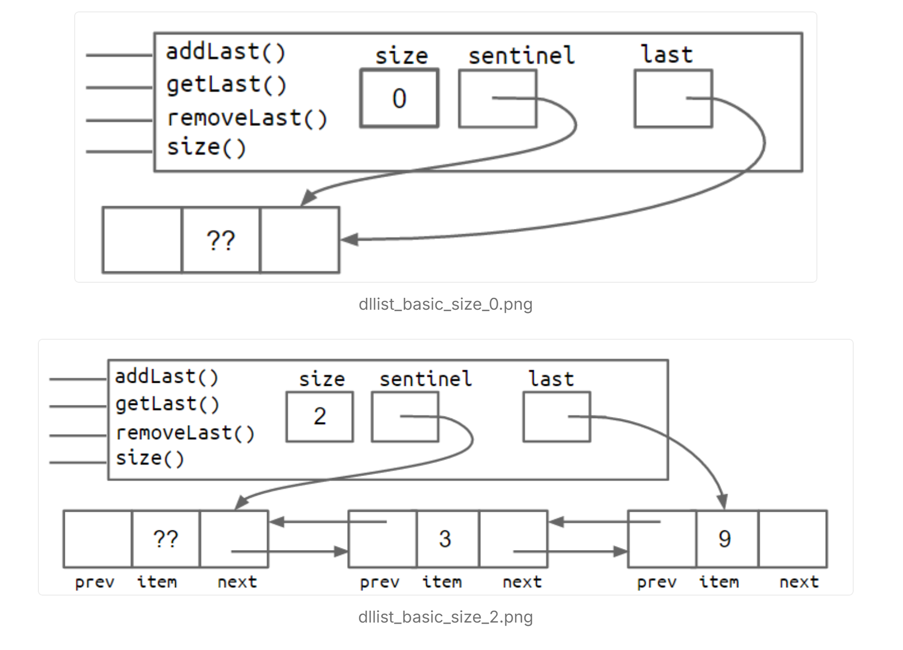
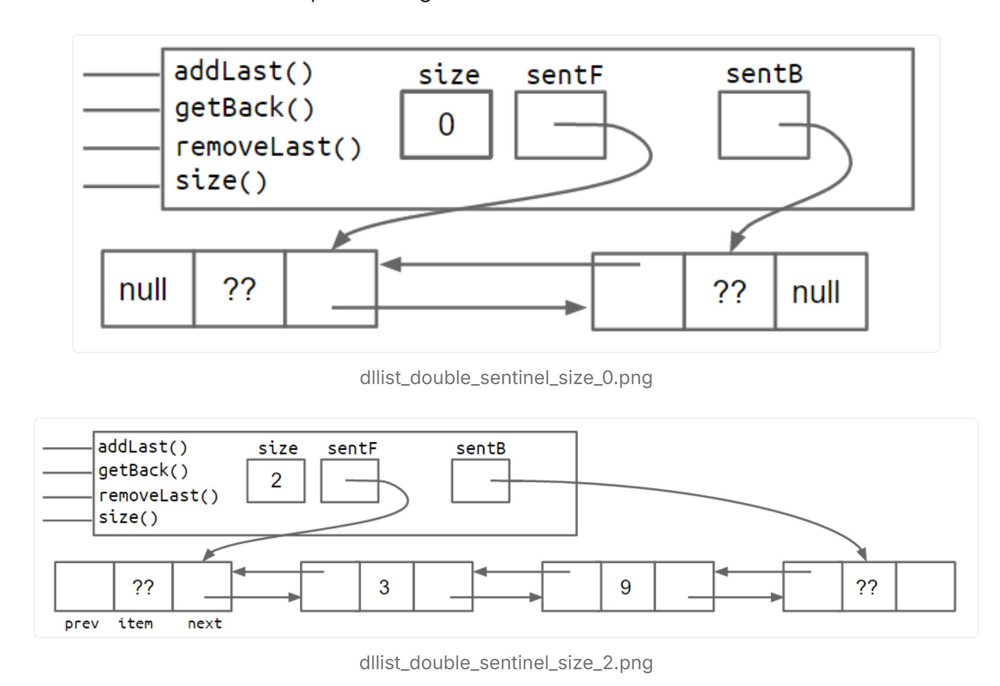
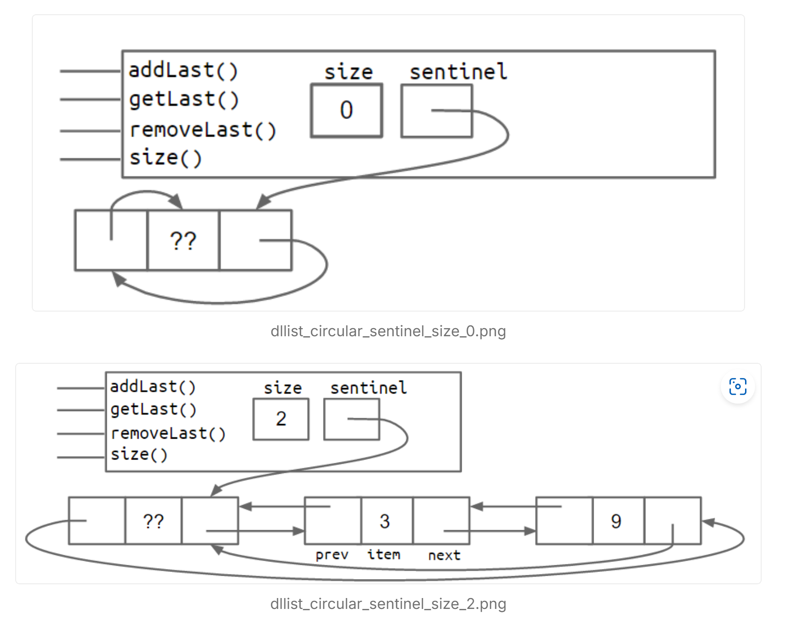

### 5. DLLists

在第2.2章中，我们构建了`SLList`类，比之前的裸递归`IntList`数据结构更好。在本节中，我们将结束关于链表的讨论，并开始学习我们称之为`AList`的基于数组的列表所需的数组基础。同时，我们也会揭示为什么在前一章中使用了`SLList`这个笨拙的名字。

#### `addLast` 方法

考虑上一章中的 `addLast(int x)` 方法。

```java
public void addLast(int x) {
    size += 1;
    IntNode p = sentinel;
    while (p.next != null) {
        p = p.next;
    }
    p.next = new IntNode(x, null);
}
```

这个方法的问题在于它很慢。对于一个长列表，`addLast` 方法必须遍历整个列表，就像我们在第2.2章的 `size` 方法中看到的一样。同样，我们可以尝试通过添加一个 `last` 变量来加快代码速度，如下所示：

```java
public class SLList {
    private IntNode sentinel;
    private IntNode last;
    private int size;    

    public void addLast(int x) {
        last.next = new IntNode(x, null);
        last = last.next;
        size += 1;
    }
    ...
}
```

#### 练习 2.3.1

考虑包含 `last` 指针的 `SLList` 实现的盒子和指针图。假设我们希望支持 `addLast`、`getLast` 和 `removeLast` 操作。这样的结构是否能支持快速的 `addLast`、`getLast` 和 `removeLast` 操作？如果不能，哪些操作会很慢？

**答案 2.3.1**：`addLast` 和 `getLast` 会很快，但 `removeLast` 会很慢。这是因为我们没有简单的方法在移除最后一个节点后更新 `last` 指针以指向倒数第二个节点。

#### 改进 #7：回顾

解决这个问题的最自然方法是为每个 `IntNode` 添加一个 `prev` 指针，即：

```java
public class IntNode {
    public IntNode prev;
    public int item;
    public IntNode next;
}
```

换句话说，我们的列表现在每个节点都有两个链接。这种列表的一个常见术语是“双向链表”（Doubly Linked List），我们简称为 `DLList`。这与第2.2章的单向链表（SLList）形成对比。

增加这些额外的指针会导致额外的代码复杂性。相反，你将在项目1中自己构建一个双向链表。下面的盒子和指针图更准确地展示了大小为0和大小为2的双向链表的样子。



#### 改进 #8：哨兵节点升级

回指针允许列表支持在常量时间内添加、获取和移除列表的前端和后端。然而，这种设计有一个微妙的问题，即 `last` 指针有时指向哨兵节点，有时指向实际节点。就像非哨兵版本的 `SLList` 一样，这导致代码中存在特殊情况，比我们第8次也是最后一次改进后的代码更丑陋。（你能想到哪些 `DLList` 方法会有这些特殊情况吗？）

一种解决方法是向列表的末端添加第二个哨兵节点。这会产生如下的拓扑结构，如盒子和指针图所示。



另一种方法是实现列表，使其成为循环列表，前后指针共享同一个哨兵节点。



两种哨兵节点方法都能工作并且使代码摆脱丑陋的特殊情况，尽管我个人觉得循环方法更简洁、更美观。我们不会讨论这些实现的细节，你将在项目1中有机会探索其中一种或两种。

#### Generic DLLists 详细总结

##### 现有 DLLists 的局限性
- **当前问题**：现有的双向链表（DLList）只能存储整数类型的值。例如，如果尝试创建一个存储字符串的链表，会因为构造函数和 `addLast` 方法仅支持整数而导致代码崩溃。
  ```java
  DLList d2 = new DLList("hello"); // 错误：不支持字符串
  d2.addLast("world"); // 错误：不支持字符串
  ```

##### 泛型（Generics）解决方案
- **Java 泛型**：Java 在 2004 年引入了泛型，允许创建能够存储任何引用类型的通用数据结构。这意味着 DLList 可以修改为支持任意类型的值。

##### 泛型的语法
- **基本语法**：在类声明时，使用尖括号 `<>` 指定一个任意的占位符类型名，然后在类中的任何地方使用这个占位符来代替具体类型。
  - **原始 DLList 定义**：
    ```java
    public class DLList {
        private IntNode sentinel;
        private int size;

        public class IntNode {
            public IntNode prev;
            public int item;
            public IntNode next;
            // ...
        }
        // ...
    }
    ```
  - **泛型 DLList 定义**：
    ```java
    public class DLList<BleepBlorp> {
        private IntNode sentinel;
        private int size;

        public class IntNode {
            public IntNode prev;
            public BleepBlorp item;
            public IntNode next;
            // ...
        }
        // ...
    }
    ```
    在这个例子中，`BleepBlorp` 是一个任意占位符，可以用任何名称代替（如 `GloopGlop`、`Horse` 等）。

##### 泛型类的实例化
- **实例化语法**：在实例化泛型类时，需要在声明时使用尖括号指定具体类型，并在实例化时使用空尖括号：
  
  ```java
  DLList<String> d2 = new DLList<>("hello");
  d2.addLast("world");
```
  
- **使用引用类型**：泛型只能与引用类型一起使用，不能与基本类型（如 `int`、`double`）直接使用。对于基本类型，需要使用相应的包装类，如 `Integer` 代替 `int`：
  
  ```java
  DLList<Integer> d1 = new DLList<>(5);
  d1.insertFront(10);
  ```

##### 泛型使用的注意事项
- **规则总结**：
  1. 在实现数据结构的 `.java` 文件中，只需在类名后指定一次泛型类型。
  2. 在使用数据结构的其他 `.java` 文件中，声明时指定具体的类型，并在实例化时使用空尖括号。
  3. 如果需要为基本类型使用泛型，使用相应的包装类（如 `Integer`、`Double` 等）代替基本类型。

- **小细节**：可以在实例化时重复声明类型（虽然不必要），这在某些情况下可以提高代码的可读性：
  ```java
  DLList<Integer> d1 = new DLList<Integer>(5); // 有效，但冗余
  ```

##### 下一步
- 你现在已经掌握了实现 `LinkedListDeque` 项目所需的所有知识，这将在项目 1 中应用和巩固你在前几章（2.1, 2.2, 2.3）中学到的内容。


## 其他（lab2 中传入数字递归生成链表）

```java
    public static IntList of(int... argList) {
        if (argList.length == 0)
            return null;
        int[] restList = new int[argList.length - 1];
        System.arraycopy(argList, 1, restList, 0, argList.length - 1);
        return new IntList(argList[0], IntList.of(restList));
    }
```

Java中定义可变参数的方法。`int...`表示参数的数量是可变的，可以传入任意数量的 `int` 类型参数，`argList` 则会作为数组来处理这些参数。


```
IntList lst = new IntList(1, new IntList(2, new IntList(3, null)));
```

```打印
    public String print() {
        if (rest == null) {
            // Converts an Integer to a String!
            return String.valueOf(first);
        } else {
            return first + " -> " + rest.print();
        }
    }
}
```

###### 