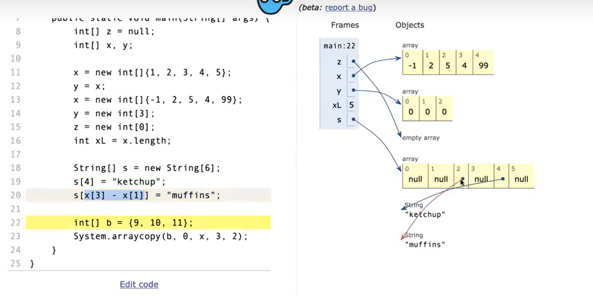
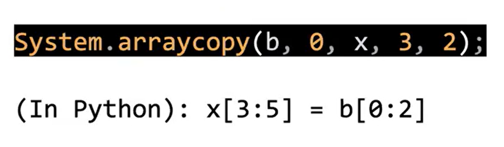
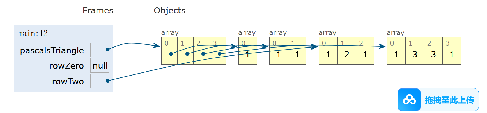
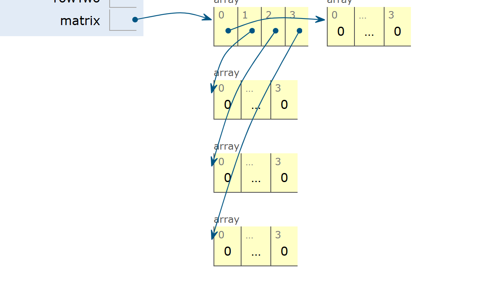
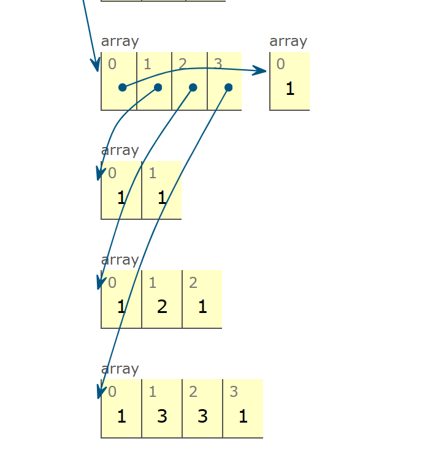

到目前为止，我们已经了解了如何利用递归类定义来创建一个可扩展的列表类，包括 `IntList`、`SLList` 和 `DLList`。在本书的接下来的两部分中，我们将讨论如何使用数组来构建列表类。

本书的这一部分假设你已经接触过数组，并且并非旨在成为关于数组语法的全面指南。

### 数组基础

为了最终构建一个可以保存信息的列表，我们需要某种方法来获取内存单元。之前，我们已经看到了如何通过变量声明和类实例化来获取内存单元。例如：

- `int x;` 为我们提供了一个32位的内存单元，用于存储整数。
- `Walrus w1;` 为我们提供了一个64位的内存单元，用于存储 Walrus 的引用。
- `Walrus w2 = new Walrus(30, 5.6);` 为我们提供了总共3个内存单元。一个64位的单元存储 Walrus 的引用，一个32位的单元存储 Walrus 的整型大小，另一个64位的单元存储 Walrus 的双精度牙齿大小。

数组是一种特殊类型的对象，由一系列编号的内存单元组成。这与类实例不同，类实例具有命名的内存单元。要获取数组的第 `i` 个元素，我们使用方括号表示法，如我们在 `HW0` 和 `Project 0` 中看到的那样，例如 `A[i]` 用于获取 `A` 的第 `i` 个元素。

数组包括：

- 一个固定的整数长度 `N`
- 一个 `N` 个内存单元的序列（`N = length`），其中所有单元类型相同，并且编号从 `0` 到 `N - 1`

与类不同，数组没有方法。

### 数组的创建

数组创建有三种有效的表示法。尝试运行下面的代码，看看会发生什么。点击此处查看交互式可视化。

```java
x = new int[3];
y = new int[]{1, 2, 3, 4, 5};
int[] z = {9, 10, 11, 12, 13};
```

这三种表示法都创建了一个数组。用于创建 `x` 的第一种表示法将创建一个指定长度的数组，并将每个内存单元填充默认值。在这种情况下，它将创建一个长度为 `3` 的数组，并将这三个单元分别填充为默认的整型值 `0`。

用于创建 `y` 的第二种表示法根据指定的初始值创建一个具有确切大小的数组。在这种情况下，它创建了一个长度为 `5` 的数组，并包含这五个特定的元素。

用于声明和创建 `z` 的第三种表示法与第二种表现方式行为相同。唯一的区别是它省略了 `new` 的使用，并且只能在与变量声明结合使用时才有效。

这三种表示法都没有优劣之分。

### 数组访问和修改

以下代码展示了我们将用于操作数组的所有关键语法。尝试逐步执行下面的代码，并确保你理解每行代码执行时会发生什么。要这样做，点击此处查看交互式可视化。除了最后一行代码，我们之前已经见过所有这些语法。

```java
int[] z = null;
int[] x, y;

x = new int[]{1, 2, 3, 4, 5};
y = x;
x = new int[]{-1, 2, 5, 4, 99};
y = new int[3];
z = new int[0];
int xL = x.length;

String[] s = new String[6];
s[4] = "ketchup";
s[x[3] - x[1]] = "muffins";

int[] b = {9, 10, 11};
System.arraycopy(b, 0, x, 3, 2);
```





最后一行展示了一种将信息从一个数组复制到另一个数组的方法。`System.arraycopy` 需要五个参数：

1. 用作源的数组
2. 在源数组中的起始位置
3. 用作目标的数组
4. 在目标数组中的起始位置
5. 要复制的项目数量

对于 Python 老手来说，`System.arraycopy(b, 0, x, 3, 2)` 相当于在 Python 中的 `x[3:5] = b[0:2]`。

**`b`**: 这是源数组，表示我们要从中复制数据的数组。

**`0`**: 这是源数组 `b` 的起始位置（索引），表示从数组 `b` 的第一个元素开始复制。

**`x`**: 这是目标数组，表示我们要将数据复制到的数组。

**`3`**: 这是目标数组 `x` 的起始位置（索引），表示从数组 `x` 的索引为 `3` 的位置开始粘贴数据。

**`2`**: 这是要复制的元素数量，表示从源数组 `b` 中复制多少个元素到目标数组 `x` 中。

复制数组的另一种方法是使用循环。`arraycopy` 通常比循环更快，并且代码更简洁。唯一的缺点是 `arraycopy`（可以说）更难读。注意，Java 数组仅在运行时执行边界检查。也就是说，以下代码在编译时完全没有问题，但在运行时会崩溃。

```java
int[] x = {9, 10, 11, 12, 13};
int[] y = new int[2];
int i = 0;
while (i < x.length) {
    y[i] = x[i];
    i += 1;
}
```

尝试在本地运行此代码或在可视化工具中运行。崩溃时遇到的错误名称是什么？这个错误名称是否有意义？

### Java 中的二维数组

在 Java 中所谓的二维数组实际上只是数组的数组。它们遵循我们已经学习的对象的相同规则，但让我们回顾一下以确保我们理解它们的工作原理。

数组的数组的语法可能有点混乱。考虑代码 `int[][] bamboozle = new int[4][];` 这创建了一个名为 `bamboozle` 的整数数组的数组。具体来说，这会创建四个内存单元中的每一个可以指向一个整数数组（长度未指定）。

尝试逐行运行下面的代码，看看结果是否符合你的直觉。要查看交互式可视化，请点击此处。

```java
int[][] pascalsTriangle;
pascalsTriangle = new int[4][];
int[] rowZero = pascalsTriangle[0];

pascalsTriangle[0] = new int[]{1};
pascalsTriangle[1] = new int[]{1, 1};
pascalsTriangle[2] = new int[]{1, 2, 1};
pascalsTriangle[3] = new int[]{1, 3, 3, 1};
int[] rowTwo = pascalsTriangle[2];
rowTwo[1] = -5;

int[][] matrix;
matrix = new int[4][];
matrix = new int[4][4];

int[][] pascalAgain = new int[][]{{1}, {1, 1},
                                 {1, 2, 1}, {1, 3, 3, 1}};
```







练习 2.4.1：运行以下代码后，`x[0][0]` 和 `w[0][0]` 的值会是多少？点击此处检查你的答案。

```java
int[][] x = {{1, 2, 3}, {4, 5, 6}, {7, 8, 9}};

int[][] z = new int[3][];
z[0] = x[0];
z[1] = x[1];
z[2] = x[2];
z[0][0] = -z[0][0];

int[][] w = new int[3][3];
System.arraycopy(x[0], 0, w[0], 0, 3);
System.arraycopy(x[1], 0, w[1], 0, 3);
System.arraycopy(x[2], 0, w[2], 0, 3);
w[0][0] = -w[0][0];
```

### 数组与类的对比

数组和类都可以用来组织一组内存单元。在这两种情况下，内存单元的数量是固定的，也就是说，数组的长度不能改变，类字段也不能添加或删除。

数组和类的内存单元的主要区别：

- 数组单元是编号的，使用 `[]` 表示法访问；类单元是命名的，使用点表示法访问。
- 数组单元必须都是相同类型的，而类单元可以是不同类型的。

这些区别中一个特别显著的影响是，`[]` 表示法允许我们在运行时指定我们想要的索引。例如，考虑以下代码：

```java
int indexOfInterest = askUserForInteger();
int[] x = {100, 101, 102, 103};
int k = x[indexOfInterest];
System.out.println(k);
```

如果我们运行这段代码，可能会得到如下结果：

```java
$ javac arrayDemo
$ java arrayDemo
What index do you want? 2
102
```

相比之下，指定类中的字段并不是我们在运行时所做的事情。例如，考虑以下代码：

```java
String fieldOfInterest = "mass";
Planet p = new Planet(6e24, "earth");
double mass

 = p[fieldOfInterest];
```

如果我们尝试编译这段代码，会得到一个语法错误：

```java
$ javac classDemo
FieldDemo.java:5: error: array required, but Planet found
        double mass = earth[fieldOfInterest];        
                               ^
```

如果我们尝试使用点表示法，也会遇到同样的问题：

```java
String fieldOfInterest = "mass";
Planet p = new Planet(6e24, "earth");
double mass = p.fieldOfInterest;
```

编译时会得到：

```java
$ javac classDemo
FieldDemo.java:5: error: cannot find symbol
        double mass = earth.fieldOfInterest;        
                           ^
  symbol:   variable fieldOfInterest
  location: variable earth of type Planet
```

这是你不太会经常遇到的限制，但为了学术的严谨性值得指出。顺便说一下，有一种方法可以在运行时指定所需字段，称为反射（Reflection），但在典型程序中使用反射被认为是非常糟糕的编码风格。你可以在此处阅读更多关于反射的内容。你永远不应该在任何 61B 程序中使用反射，并且我们在课程中不会讨论它。

一般来说，编程语言的设计部分是为了限制程序员的选择，使代码更容易推理。通过将这些功能限制在特殊的反射 API 中，我们使典型的 Java 程序更易于阅读和解释。

### 附录：Java 数组与其他语言的对比

与其他语言的数组相比，Java 数组：

- 没有“切片”的特殊语法（例如 Python 中的切片）。
- 不能缩小或扩展（例如 Ruby 中的数组）。
- 没有成员方法（例如 Javascript 中的数组）。
- 必须只包含相同类型的值（与 Python 不同）。